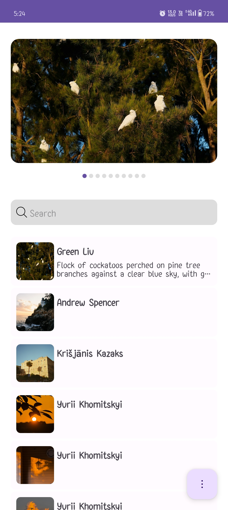
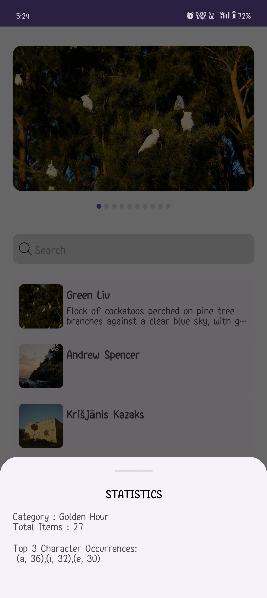
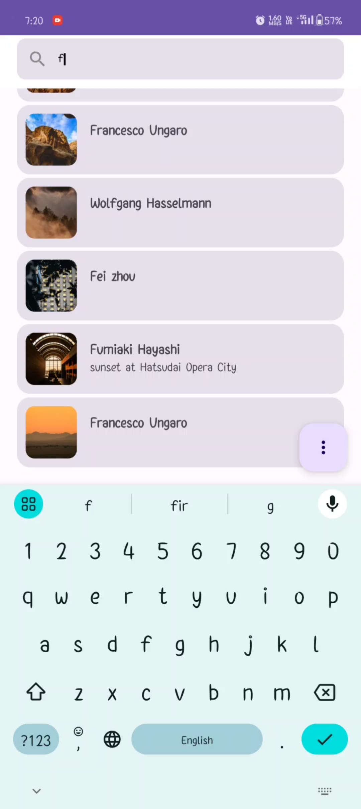
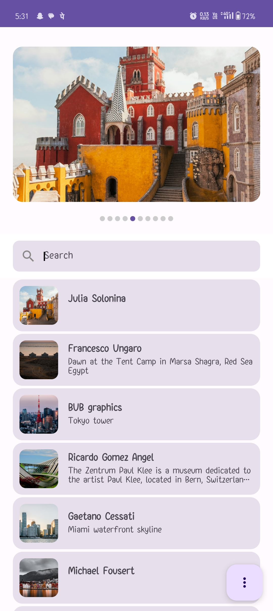
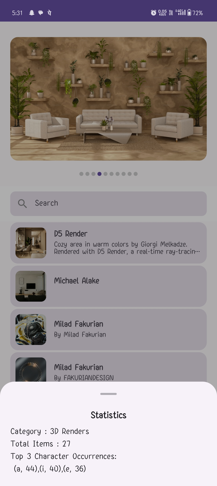
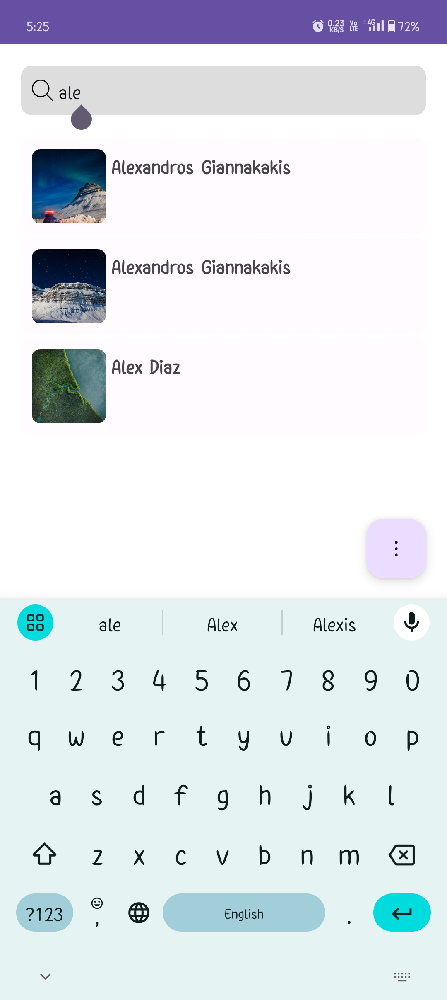

# BlueApp

## Features

- Clear App Architecture,Use Cases.
- Jetpack Compose UI.
- Dependency injection with Hilt.

## Libraries

- Jetpack Compose
- Hilt
- ViewModel
- Retrofit
- Coil

## Result

### XML based UI

|  |  |  | 
|----------|:-------------:|:-------------:|

### Compose UI

|  |  |  | 
|----------|:-------------:|:-------------:|

### Demo
- XML
  |  |
  |----------|
- Compose 
  |  |
  |----------|
